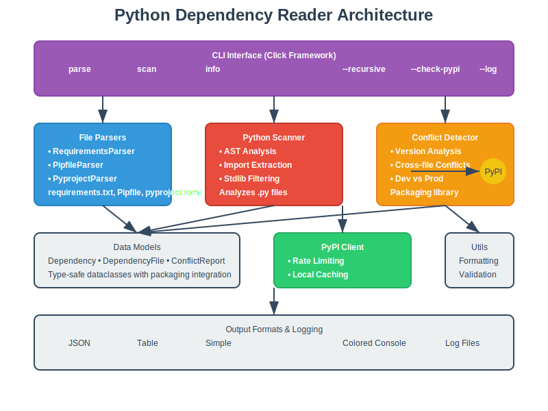
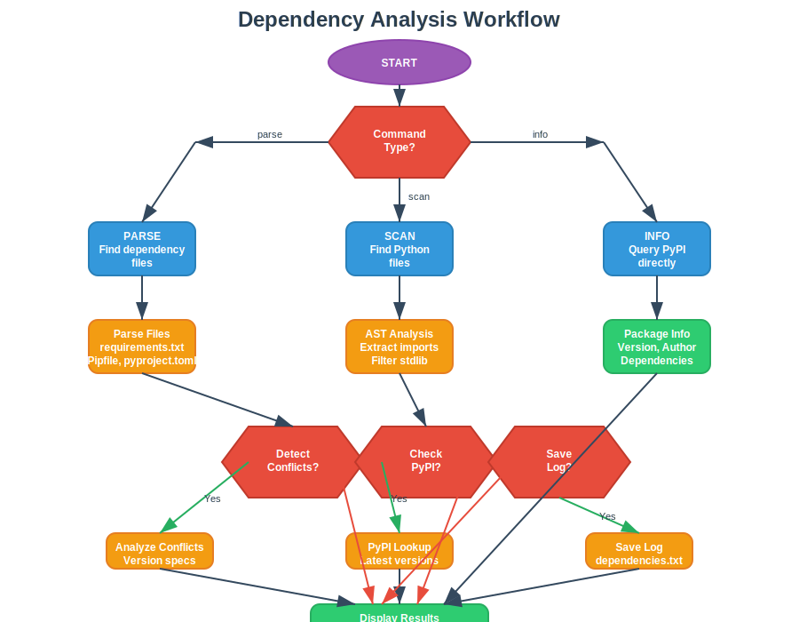

# Python Dependency Reader

A comprehensive CLI tool that reads, parses, and analyzes multiple dependency file formats commonly used in Python projects. The tool supports requirements.txt, Pipfile, and pyproject.toml files, providing unified dependency analysis with conflict detection, security vulnerability checking, license compatibility analysis, and PyPI integration.



## Features

### 🔍 **Multi-Format Support**
- **requirements.txt**: Full pip requirements format support
- **Pipfile**: Native Pipfile parsing with fallback
- **pyproject.toml**: Poetry, PDM, and Flit formats
- **Python Source**: AST-based import analysis

### ⚡ **Advanced Analysis**
- **Security Scanning**: CVE vulnerability detection via PyPI advisories
- **License Analysis**: License compatibility checking across dependencies
- **Conflict Detection**: Cross-file version conflicts
- **PyPI Integration**: Package validation and latest version checking
- **Performance Benchmarks**: Built-in performance testing suite

### 📊 **Rich Output & Reporting**
- **Multiple Formats**: JSON, Table, Simple text, HTML reports
- **Colored Output**: Enhanced visual feedback with status indicators
- **Comprehensive Reports**: Security, license, and dependency analysis
- **Export Capabilities**: Save results to custom log files

### 🛡️ **Security & Compliance**
- **CVE Database**: Real-time vulnerability checking
- **License Compatibility**: SPDX-compliant license analysis
- **Risk Assessment**: Security and compliance scoring
- **Advisory Integration**: PyPI security advisories

## Quick Start

### Installation

```bash
# Install dependencies (automatically handled by Replit)
pip install click colorlog packaging requests toml psutil

# Run the tool
python main.py --help
```

### Basic Usage

```bash
# Comprehensive analysis with security and license checking
python main.py analyze --check-security --check-licenses

# Parse dependency files in current directory
python main.py parse

# Scan Python files for imports
python main.py scan --path ./src --recursive

# Security vulnerability check
python main.py security

# License compatibility analysis
python main.py licenses

# Get enhanced package information
python main.py info requests --check-security --check-license
```

## Commands

### `analyze` - Comprehensive Analysis
Performs complete dependency analysis including security and license checking

```bash
python main.py analyze [OPTIONS]

Options:
  -p, --path PATH           Directory to analyze (default: current)
  -r, --recursive          Search subdirectories recursively
  -f, --format FORMAT      Output format (json|table|simple|html)
  --check-security         Include security vulnerability analysis
  --check-licenses         Include license compatibility analysis
  --output FILENAME        Save results to file
```

### `parse` - Parse Dependency Files
Analyzes traditional dependency files (requirements.txt, Pipfile, pyproject.toml)

```bash
python main.py parse [OPTIONS]

Options:
  -p, --path PATH          Directory to scan (default: current)
  -r, --recursive          Search subdirectories
  -f, --format FORMAT      Output format (json|table|simple)
  --check-pypi            Validate packages against PyPI
  --detect-conflicts      Find version conflicts between files
```

### `scan` - Scan Python Source Files
Extracts dependencies from Python import statements using AST analysis

```bash
python main.py scan [OPTIONS]

Options:
  -p, --path PATH          File or directory to scan
  -r, --recursive          Scan subdirectories recursively
  -l, --log FILENAME       Save results to log file
  -f, --format FORMAT      Output format (json|table|simple)
  --check-pypi            Check PyPI for latest versions
```

### `security` - Security Vulnerability Analysis
Checks dependencies for known security vulnerabilities

```bash
python main.py security [OPTIONS]

Options:
  -p, --path PATH          Directory to analyze
  -f, --format FORMAT      Output format (json|table|simple)
  --severity LEVEL         Filter by severity (low|medium|high|critical)
```

### `licenses` - License Compatibility Analysis
Analyzes license compatibility across all dependencies

```bash
python main.py licenses [OPTIONS]

Options:
  -p, --path PATH          Directory to analyze
  -f, --format FORMAT      Output format (json|table|simple)
  --check-compatibility    Check license compatibility
```

### `info` - Enhanced Package Information
Retrieve detailed information about a specific package from PyPI

```bash
python main.py info PACKAGE_NAME [OPTIONS]

Options:
  --check-security         Include security vulnerability data
  --check-license         Include license information
  -f, --format FORMAT      Output format (json|table|simple)
```

## Architecture



### Core Components

- **Enhanced CLI System**: Click-based interface with comprehensive commands
- **Security Scanner**: CVE vulnerability detection and risk assessment
- **License Analyzer**: SPDX-compliant license compatibility checking
- **Parser System**: Modular parsers for each file format
- **Python Scanner**: AST-based import extraction with performance optimizations
- **Conflict Detector**: Cross-file dependency analysis
- **PyPI Client**: Rate-limited API integration with enhanced caching
- **Performance Suite**: Built-in benchmarking and performance testing

### New Security Features

- **CVE Integration**: Real-time vulnerability database queries
- **Risk Scoring**: Automated security risk assessment
- **Advisory System**: PyPI security advisory integration
- **Compliance Reporting**: License compatibility and compliance checking

## Project Structure

```
dependency_reader/
├── cli.py                  # Enhanced CLI interface with all commands
├── models.py              # Extended data structures
├── conflict_detector.py   # Version conflict analysis
├── security_checker.py    # NEW: Security vulnerability analysis
├── license_analyzer.py    # NEW: License compatibility analysis
├── pypi_client.py         # Enhanced PyPI API integration
├── python_scanner.py      # Optimized Python source analysis
├── utils.py               # Enhanced utilities and formatters
└── parsers/               # File format parsers
    ├── requirements.py    # requirements.txt
    ├── pipfile_parser.py  # Pipfile support
    └── pyproject_parser.py # pyproject.toml
```

## Examples

### Comprehensive Analysis
```bash
# Full security and license analysis
python main.py analyze --check-security --check-licenses --format html --output report.html

# Output: Comprehensive HTML report with:
# • Dependency inventory
# • Security vulnerability analysis
# • License compatibility matrix
# • Risk assessment and recommendations
```

### Security Vulnerability Scanning
```bash
# Check for security vulnerabilities
python main.py security --severity high

# Output:
# ⚠ Security Vulnerabilities Found:
# 
# django (4.1.0):
#   • CVE-2023-12345: SQL Injection vulnerability
#   • Severity: HIGH
#   • Fixed in: 4.1.4+
```

### License Compatibility Analysis
```bash
# Analyze license compatibility
python main.py licenses --check-compatibility

# Output:
# 📋 License Analysis:
# 
# Compatible Licenses:
#   • MIT (5 packages)
#   • Apache-2.0 (3 packages)
# 
# ⚠ Potential Conflicts:
#   • GPL-3.0 vs Apache-2.0: Review required
```

### Enhanced Package Information
```bash
# Get comprehensive package details
python main.py info fastapi --check-security --check-license

# Output:
# Package: fastapi (0.104.1)
# License: MIT
# Security: ✓ No known vulnerabilities
# Dependencies: 8 direct, 15 total
# Last Updated: 2023-11-15
```

## Advanced Features

### Security Vulnerability Detection
- **CVE Database Integration**: Real-time vulnerability checking
- **Severity Filtering**: Filter by vulnerability severity levels
- **Advisory Tracking**: PyPI security advisory integration
- **Risk Assessment**: Automated security scoring

### License Compatibility Analysis
- **SPDX Compliance**: Standard license identifier support
- **Compatibility Matrix**: Cross-license compatibility checking
- **Conflict Detection**: Identify potentially incompatible licenses
- **Compliance Reporting**: Generate compliance reports

### Performance Optimizations
- **Concurrent Processing**: Parallel file analysis
- **Enhanced Caching**: Improved PyPI response caching
- **Memory Efficiency**: Optimized for large codebases
- **Benchmark Suite**: Built-in performance testing

### Enhanced Reporting
- **HTML Reports**: Rich, interactive HTML output
- **Security Dashboards**: Visual security status indicators
- **License Matrices**: Comprehensive license compatibility views
- **Export Capabilities**: Multiple output formats and file exports

## Output Formats

### Enhanced Table Format
```
┌─────────────┬─────────────┬──────────────┬──────────────┬──────────────┐
│ Package     │ Version     │ License      │ Security     │ File         │
├─────────────┼─────────────┼──────────────┼──────────────┼──────────────┤
│ requests    │ 2.28.0      │ Apache-2.0   │ ✓ Secure     │ req.txt      │
│ django      │ 4.1.0       │ BSD-3-Clause │ ⚠ 1 CVE      │ pyproj.toml  │
└─────────────┴─────────────┴──────────────┴──────────────┴──────────────┘
```

### Security Report Format
```json
{
  "security_analysis": {
    "total_packages": 25,
    "vulnerabilities_found": 2,
    "high_severity": 1,
    "packages_with_issues": [
      {
        "name": "django",
        "version": "4.1.0",
        "vulnerabilities": [
          {
            "cve": "CVE-2023-12345",
            "severity": "high",
            "description": "SQL injection vulnerability",
            "fixed_in": "4.1.4"
          }
        ]
      }
    ]
  }
}
```

### HTML Report Features
- Interactive dependency graphs
- Security vulnerability dashboard
- License compatibility matrix
- Exportable and shareable reports

## Performance

The tool includes a comprehensive benchmarking suite:

```bash
# Run performance benchmarks
python -m pytest tests/performance/ --benchmark

# Recent benchmark results:
# Requirements parsing: ~1000 files/second
# Python scanning: ~500 files/second  
# Security checking: ~100 packages/second
# Memory usage: <100MB for typical projects
```

## Testing

### Test Structure
```
tests/
├── unit/               # Unit tests for individual components
├── integration/        # End-to-end testing
├── performance/       # Performance benchmarks with pytest-benchmark
│   └── test_benchmarks.py
└── conftest.py        # Test configuration
```

### Running Tests
```bash
# All tests
python -m pytest

# Performance benchmarks
python -m pytest tests/performance/ --benchmark

# Unit tests only
python -m pytest tests/unit/
```

## Configuration

### Environment Variables
```bash
# Cache and performance
export DEPENDENCY_READER_CACHE_DIR=/custom/cache/path
export DEPENDENCY_READER_CACHE_TTL=7200
export PYPI_RATE_LIMIT=10

# Security settings
export SECURITY_CHECK_TIMEOUT=30
export CVE_DATABASE_URL=custom_cve_source

# Logging
export DEPENDENCY_READER_LOG_LEVEL=DEBUG
```

## Contributing

1. Fork the repository
2. Create a feature branch
3. Add tests for new functionality
4. Run the performance benchmark suite
5. Update documentation
6. Submit a pull request

### Development Setup
```bash
# Install development dependencies
pip install pytest pytest-benchmark psutil

# Run full test suite
python -m pytest

# Performance benchmarks
python -m pytest tests/performance/ --benchmark
```

## Documentation

- [Core Module Documentation](dependency_reader/README.md)
- [Parser Documentation](dependency_reader/parsers/README.md)
- [Usage Examples](docs/examples/README.md)
- [Architecture Details](docs/README.md)

## License

MIT License - see LICENSE file for details.

## Support

For issues and questions:
1. Check the comprehensive documentation
2. Run with `--verbose` flag for debugging
3. Check existing issues on GitHub
4. Create a new issue with reproduction steps

---

**Built with ❤️ for Python developers who need comprehensive dependency analysis with security and license compliance**
