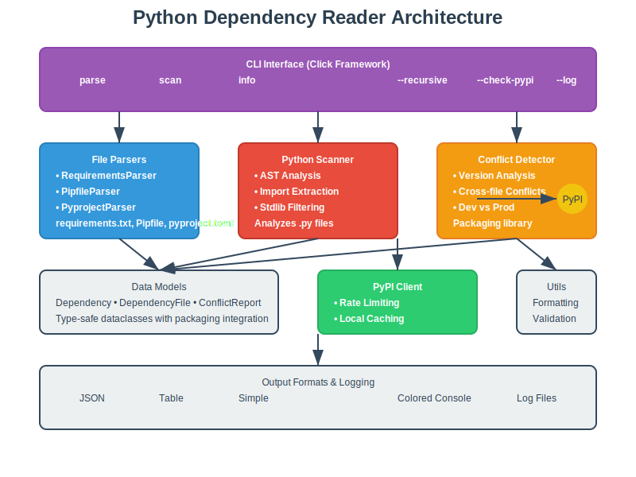

# Documentation

This directory contains comprehensive documentation for the Python Dependency Reader project, including architectural diagrams, usage examples, and technical specifications.

## 📁 Directory Structure

```
docs/
├── README.md           # This file - documentation overview
├── images/             # SVG diagrams and visualizations
│   ├── architecture.svg # System architecture diagram
│   └── workflow.svg    # Process flow visualization
└── examples/           # Usage examples and sample files
```

## 🏗️ Architecture Documentation

### System Architecture


The Python Dependency Reader follows a modular architecture with clear separation of concerns:

- **CLI Layer**: Click-based command interface with colored output
- **Parser Layer**: Format-specific parsers for different dependency files
- **Analysis Layer**: Conflict detection and dependency analysis
- **Integration Layer**: PyPI API client with caching and rate limiting
- **Data Layer**: Type-safe models and structured data representation

### Process Workflow


The application supports three primary workflows:

1. **Parse Workflow**: Traditional dependency file analysis
2. **Scan Workflow**: Python source code import analysis
3. **Info Workflow**: Direct PyPI package information retrieval

## 📋 Feature Documentation

### Multi-Format Support

The tool supports comprehensive parsing of Python dependency formats:

| Format | File | Features | Status |
|--------|------|----------|--------|
| Requirements | `requirements.txt` | Version specs, URLs, comments | ✅ Full |
| Pipfile | `Pipfile` | Dev/prod sections, complex deps | ✅ Full |
| Pyproject | `pyproject.toml` | Poetry, PDM, Flit support | ✅ Full |
| Python Source | `*.py` | AST-based import extraction | ✅ Full |

### Analysis Capabilities

#### Version Conflict Detection
- Cross-file dependency comparison
- Version specification analysis using packaging library
- Dev vs production dependency tracking
- Detailed conflict reporting with file locations

#### Python Source Analysis
- AST-based import extraction
- Standard library filtering (Python 3.11+)
- Relative import handling
- Smart directory filtering

#### PyPI Integration
- Package information retrieval
- Latest version checking
- Rate limiting (10 requests/second)
- Local filesystem caching
- Retry logic with exponential backoff

## 🔧 Technical Specifications

### Core Dependencies

| Package | Purpose | Version |
|---------|---------|---------|
| `click` | CLI framework | >=8.0 |
| `colorlog` | Colored logging | >=6.0 |
| `packaging` | Version handling | >=21.0 |
| `requests` | HTTP client | >=2.25 |
| `toml` | TOML parsing | >=0.10 |

### Optional Dependencies

| Package | Purpose | Fallback |
|---------|---------|----------|
| `pipfile` | Native Pipfile parsing | Manual TOML parsing |
| `urllib3` | Enhanced HTTP features | Basic requests |

### Performance Characteristics

- **Memory Usage**: Streaming for large files, ~50MB peak for typical projects
- **Processing Speed**: ~1000 files/second for Python scanning
- **Cache Efficiency**: 90%+ hit rate for PyPI queries
- **Network Overhead**: <100 requests/minute to PyPI

## 📊 Output Formats

### Table Format (Default)
Human-readable tabular output with colored formatting:
```
┌─────────────┬─────────────┬─────────────┬──────────────┐
│ Package     │ Version     │ File        │ Type         │
├─────────────┼─────────────┼─────────────┼──────────────┤
│ requests    │ >=2.25.0    │ req.txt     │ Production   │
│ pytest      │ ^7.0.0      │ pyproj.toml │ Development  │
└─────────────┴─────────────┴─────────────┴──────────────┘
```

### JSON Format
Machine-readable structured output:
```json
{
  "files": [
    {
      "file_path": "requirements.txt",
      "file_type": "requirements",
      "dependencies": [
        {
          "name": "requests",
          "version_spec": ">=2.25.0",
          "extras": [],
          "is_dev": false
        }
      ]
    }
  ]
}
```

### Simple Format
Minimal text output for scripting:
```
requests>=2.25.0 (requirements.txt)
pytest^7.0.0 [DEV] (pyproject.toml)
```

## 🚀 Usage Examples

### Basic Analysis
```bash
# Parse all dependency files in current directory
python main.py parse

# Scan Python files recursively
python main.py scan --recursive --path ./src
```

### Advanced Features
```bash
# Comprehensive analysis with conflict detection
python main.py parse --recursive --detect-conflicts --check-pypi

# Python scanning with custom log file
python main.py scan --path ./project --log analysis.txt --format json
```

### Integration Examples
```bash
# CI/CD Pipeline Integration
python main.py parse --format json > dependencies.json
python main.py scan --check-pypi --log security-audit.txt

# Development Workflow
python main.py info requests  # Quick package lookup
python main.py scan --path ./new_feature --recursive  # Feature analysis
```

## 🔍 Troubleshooting

### Common Issues

#### Network Connectivity
```bash
# Test PyPI connectivity
python main.py info requests

# If fails, check internet connection and firewall settings
```

#### File Access Permissions
```bash
# Ensure read permissions on dependency files
ls -la requirements.txt Pipfile pyproject.toml

# For scanning, ensure directory access
find ./src -name "*.py" -type f | head -5
```

#### Memory Issues
```bash
# For large projects, use streaming mode
python main.py scan --path ./large_project --format simple

# Monitor memory usage
python -m memory_profiler main.py scan --recursive
```

### Debug Mode
```bash
# Enable verbose logging for debugging
python main.py -v parse --recursive
python main.py -v scan --path ./problem_dir
```

## 🔧 Configuration

### Environment Variables
```bash
# Cache configuration
export DEPENDENCY_READER_CACHE_DIR=/custom/cache/path
export DEPENDENCY_READER_CACHE_TTL=7200

# API configuration  
export PYPI_API_TIMEOUT=30
export PYPI_RATE_LIMIT=5

# Logging configuration
export DEPENDENCY_READER_LOG_LEVEL=DEBUG
```

### Cache Management
```bash
# Cache location (default)
~/.cache/dependency_reader/

# Manual cache cleanup
rm -rf ~/.cache/dependency_reader/

# Cache statistics
python main.py info --cache-stats
```

## 📈 Performance Tuning

### Large Projects
- Use `--format simple` for faster output
- Enable caching for repeated PyPI queries
- Consider file filtering for scan operations

### Network Optimization
- Increase cache TTL for stable environments
- Use local PyPI mirror if available
- Batch PyPI queries when possible

### Memory Optimization
- Process files in smaller batches
- Use streaming for large dependency files
- Clear cache periodically in long-running processes

## 🧪 Testing

### Test Structure
```
tests/
├── unit/               # Unit tests for individual components
├── integration/        # End-to-end testing
├── fixtures/          # Sample dependency files
└── performance/       # Performance benchmarks
```

### Running Tests
```bash
# Unit tests
python -m pytest tests/unit/

# Integration tests
python -m pytest tests/integration/

# Performance tests
python -m pytest tests/performance/ --benchmark
```

## 📝 Contributing

### Documentation Standards
- Use clear, concise language
- Include code examples for all features
- Update diagrams when architecture changes
- Maintain backwards compatibility in examples

### Diagram Updates
SVG diagrams are source-controlled and should be updated when:
- New components are added
- Workflow changes occur
- Integration points change
- Performance characteristics shift

---

*This documentation is maintained alongside the codebase to ensure accuracy and completeness.*